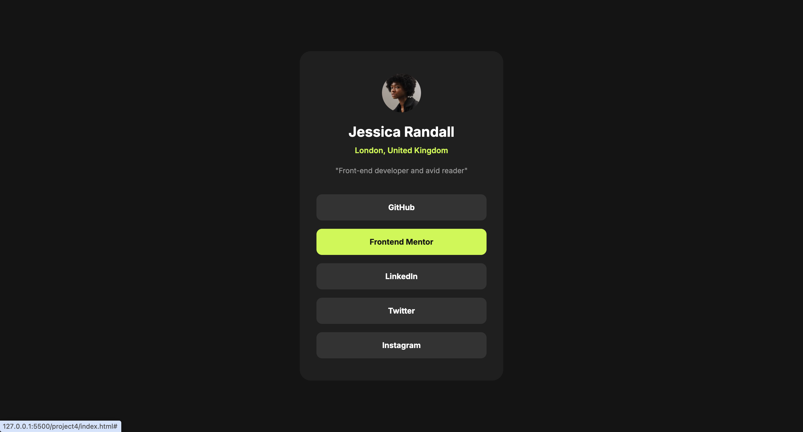

# Frontend Mentor - Social links profile solution

This is a solution to the [Social links profile challenge on Frontend Mentor](https://www.frontendmentor.io/challenges/social-links-profile-UG32l9m6dQ). Frontend Mentor challenges help you improve your coding skills by building realistic projects.

## Table of contents

- [Overview](#overview)
  - [The challenge](#the-challenge)
  - [Screenshot](#screenshot)
  - [Links](#links)
- [My process](#my-process)
  - [Built with](#built-with)
  - [What I learned](#what-i-learned)
  - [AI Collaboration](#ai-collaboration)

## Overview

### The challenge

I completed the "Social links profile" challenge. It was a nice, straightforward practice that helped me improve my front-end skills and structure my code better.

### Screenshot



### Links

- Solution URL: https://github.com/Raghad2088/Social-links-profile-solution
- Live Site URL: https://raghad2088.github.io/Social-links-profile-solution/

## My process

### Built with

- Semantic HTML5 markup
- CSS custom properties
- Flexbox
- Mobile-first workflow

### What I learned

During this challenge, I focused on improving my Semantic HTML5 structure. I learned a clear distinction of when to use the `<figure>` and `<figcaption>` tags versus standard header tags (like `<h1>` and `<p>`). I also practiced making the links completely accessible by expanding their clickable area using `display: block` and added smooth interactive states using `:hover` and `transition`.

Here is a snippet of the interactive link styling I used:

```css
ul li {
  transition: background-color 0.3s ease;
}

ul li a {
  display: block;
  padding: 15px 30px;
}
```

### AI Collaboration

I collaborated with Gemini AI during this project to review my code and refine my implementation:
Debugging & Best Practices: The AI helped me spot a casing mismatch in my CSS class names (Profile-header vs profile-header) that was blocking my styles from rendering.
Conceptual Learning: We discussed the correct semantic usage of the <figure> tag, helping me understand that it's meant for independent illustrative content rather than standard profile headers.
UX Improvements: The AI suggested moving the padding to the <a> tag to ensure the entire button area is clickable, which significantly improved the user experience.
